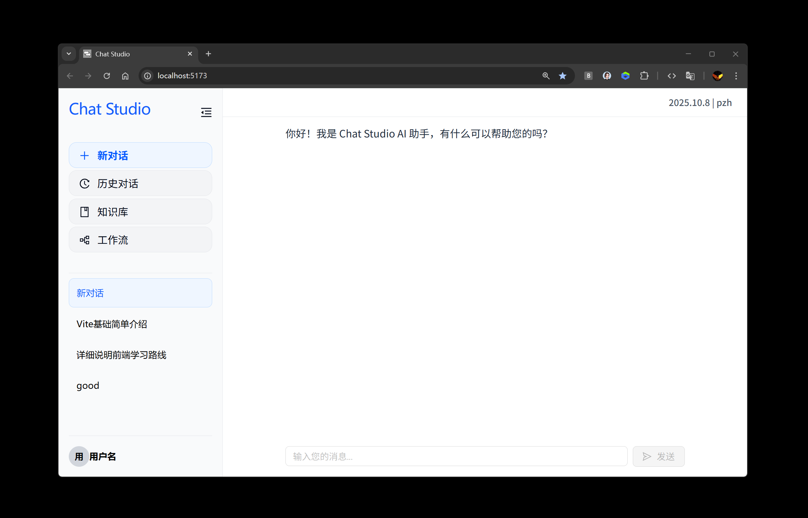

# Chat Studio

<div align="center">
  <p>
    <a href="README.md">🇨🇳 中文</a> | 
    <a href="#english">🇺🇸 English</a>
  </p>
</div>

<div align="center">
  
</div>

**Chat Studio：** An open-source AI conversation platform supporting multi-session concurrency, knowledge base enhancement, and automated workflows. Built with React + TypeScript frontend and Node.js backend.

## Tech Stack

- **Frontend**: React 19 + TypeScript + Vite
- **UI**: Ant Design + Tailwind CSS
- **Tooling**: Vite + ESLint + PostCSS + pnpm
- **Backend**: Node.js + Express
- **Database**: SQLite (Local Development)
- **Authentication**: JWT Token
- **Markdown**: react-markdown + remark-gfm + rehype-highlight
- **Code Highlighting**: highlight.js

## Features

- **AI Intelligent Chat**

  - **AI Integration**: Support for multiple AI models including Qwen3, ChatGPT, DeepSeek, GLM, etc., with real-time model switching
  - **Persistent Sessions**: Chat history stored locally, data persists after refresh
  - **Multi-Session Concurrency**: Support multiple conversations simultaneously with independent input states, contexts, and UI
  - **Smart Titles**: Auto-generate session titles based on user's first message for better readability
  - **Real-time Interaction**: Loading state feedback, intelligent scroll control, streaming reply bottom attachment
  - **Stop Generation**: Support interrupting AI message generation for better user control
  - **Markdown Rendering**: Full support for Markdown syntax, code highlighting, tables, lists, and other formatting
  - **Streaming Output**: Real-time display of AI reply content with streaming syntax repair and intelligent rendering
  - **Statistics Info**: Display AI reply model information, response time, and token consumption statistics
  - **Error Handling**: Friendly prompts and handling mechanisms for network exceptions and API errors
  - **Responsive Design**: Optimized for desktop and mobile with sidebar collapse functionality, excellent user experience in small windows

- **User System & Cloud Sync**

  - **User Authentication**: Support user registration and login functionality
  - **Cloud Sync**: Automatic cloud backup and synchronization of logged-in users' chat history
  - **Session Management**: Intelligent merging and management of local and cloud session data

- **Knowledge Base** (In Development)
- **Workflows** (In Development)

## Quick Start

**Requirements**: Node.js ≥18, pnpm ≥8

```bash
# Clone the project
git clone https://github.com/your-username/chat-studio.git
cd chat-studio

# Install dependencies (one-click installation for both frontend and backend)
pnpm install:all

# Start development server (both frontend and backend)
pnpm dev

# Start frontend only (http://localhost:5173)
pnpm client:dev

# Start backend only (http://localhost:3001)
pnpm server:dev

# Build for production
pnpm build
```

## Project Structure

```
chat-studio/
├── client/          # Frontend code (React + TypeScript)
│   ├── src/
│   │   ├── components/  # Component library
│   │   ├── contexts/    # React Context
│   │   ├── hooks/       # Custom Hooks
│   │   ├── pages/       # Page components
│   │   ├── types/       # TypeScript type definitions
│   │   └── utils/       # Utility functions
│   └── package.json
├── server/          # Backend code (Node.js + Express)
│   ├── routes/      # API routes
│   ├── db/          # Database related
│   └── package.json
└── package.json     # Root configuration
```
