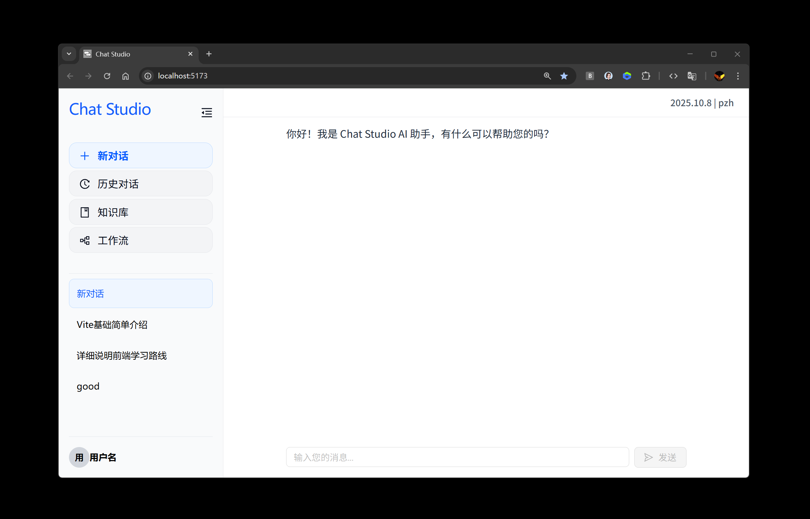

# Chat Studio

<div align="center">
  <p>
    <a href="#中文">🇨🇳 中文</a> | 
    <a href="README.en.md">🇺🇸 English</a>
  </p>
</div>

<div align="center">
  
</div>

**Chat Studio：** 一个开源的 AI 对话平台，支持多会话并发、知识库增强与自动化工作流。前端基于 React + TypeScript 构建，后端采用 Node.js。

## Chat Studio - Frontend Only (Backup) 纯前端备份

- 此分支（`backup-frontend-only`）保留了项目的初始状态：
- 一个**独立的 React + Vite 前端**，尚未集成任何后端服务。
- 用于在引入 Express 服务与 API 迁移前的干净快照。

## 技术栈

- **前端**: React 19 + TypeScript + Vite
- **UI**: Ant Design + Tailwind CSS
- **工程化**: Vite + ESLint + PostCSS + pnpm
- **后端**: Node.js

## 功能特性

- **AI 智能对话聊天**

  - **AI 集成** ：支持 Qwen3、ChatGPT 等多个 AI 模型
  - **持久化会话** ：对话历史本地存储，刷新后数据不丢失
  - **多会话并发** ：支持多个对话同时发送消息，各会话具备独立的输入状态、上下文和 UI，互不干扰
  - **智能标题** ：根据用户首条消息自动生成会话标题，提高可读性
  - **实时交互** ：加载状态反馈，自动滚动到最新消息
  - **错误处理** ：网络异常、 API 错误处理机制
  - **响应式设计** ：适配桌面端和移动端，在小窗口也有良好的用户体验

- **知识库**（开发中）
- **工作流**（开发中）

## 快速开始

**环境要求**：Node.js ≥18，pnpm ≥8

```bash
# 安装依赖
pnpm i

# 启动开发服务器（http://localhost:5173）
pnpm dev

# 构建生产版本
pnpm build
```
